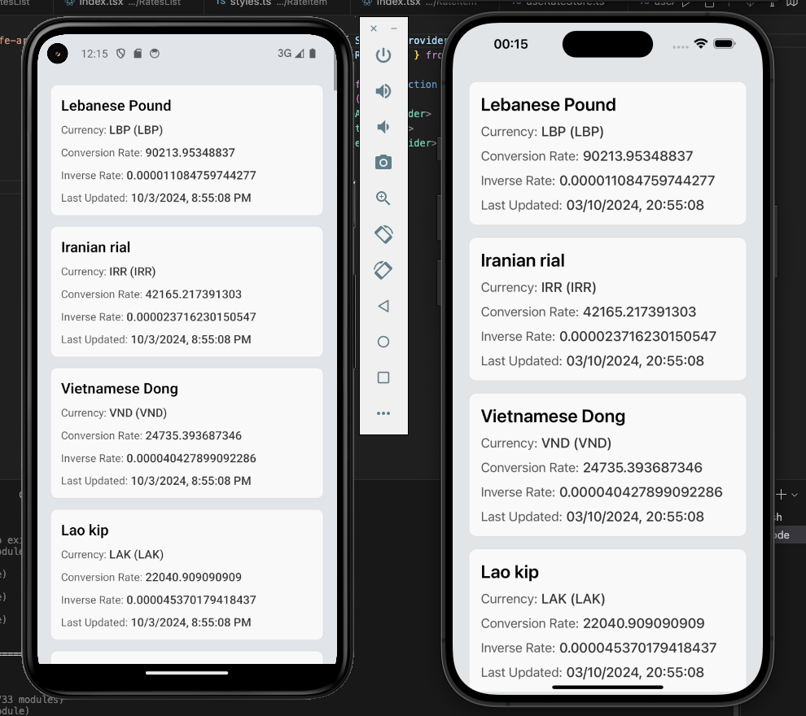

# Float Rates

This is the repository for the Float Rates application.

## 📷 Screenshots



## 🛠️ Technologies Used

- **React Native**: A framework for building native apps using React.
- **Expo**: A framework and platform for universal React applications.
- **TypeScript**: A superset of JavaScript that adds static typing to the code.
- **Zustand**: A small, fast, and scalable bearbones state-management solution.

## ⚙️ Features

- **Data Fetching**: Fetch and display real-time floating rates from an external API using Axios.
- **State Management**: Utilize Zustand for managing application state efficiently.
- **Responsive Design**: Adapts to various screen sizes, providing an optimal experience across devices.
- **Async Storage**: Persist data locally using Async Storage for offline access and faster load times.

## 📦 Project Structure

```bash
src/
├── components/          # Reusable components
├── domain/              # Domain logic and entities
├── hooks/               # Custom hooks
├── query/               # API request functions, organized by module
├── screens/             # Application screens
├── services/            # API service functions
├── store/               # Zustand store management
└── utils/               # Utility functions
```

## 📚 Documentation

### Installation

To run the project locally, follow the steps below:

1. Clone the project:

```bash
git clone https://github.com/enzoodev/float-rates.git
```

2. Install dependencies:

```bash
yarn install
# or
npm install
```

3. Start the development server:

```bash
yarn start
# or
npm run start
```

4. Run on iOS or Android:

```bash
yarn ios / yarn android
# or
npm run ios / npm run android
```
